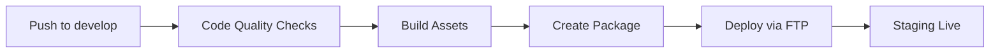

# Deployment Guide

## CI/CD Pipeline Overzicht

Dit project gebruikt GitHub Actions voor geautomatiseerde deployment en code quality checks.

## Workflows

### 1. Code Quality Checks (`code-quality.yml`)

**Trigger**: Bij elke push en pull request naar `main` of `develop`

**Taken**:
- ✅ JavaScript linting
- ✅ CSS linting
- ✅ Format checking
- ✅ Design tokens validatie (geen hardcoded values)
- ✅ BEM naming convention check
- ✅ Component file structure validatie

### 2. Pull Request Checks (`pr-checks.yml`)

**Trigger**: Bij elke PR

**Taken**:
- 📋 PR informatie weergeven
- 📝 Changed files lijst
- 🧩 Component library status
- 📦 Bundle size rapport
- ✅ Ready-to-merge check

### 3. Deploy to Staging (`deploy-staging.yml`)

**Trigger**:
- Automatisch bij push naar `develop` branch
- Handmatig via workflow_dispatch

**Stappen**:
1. **Build** - Compileert blocks en maakt deployment package
2. **Deploy** - Uploadt via FTP naar staging server
3. **Notify** - Stuurt deployment status notificatie

## Required Secrets

Configureer deze secrets in GitHub:
**Settings → Secrets and variables → Actions**

### Staging Environment

```
STAGING_FTP_SERVER     # FTP server hostname (bijv. ftp.yourdomain.com)
STAGING_FTP_USERNAME   # FTP username
STAGING_FTP_PASSWORD   # FTP password
```

### Environment Variables

```
STAGING_URL           # Staging website URL (bijv. https://staging.yourdomain.com)
```

## Setup Instructies

### 1. GitHub Secrets Toevoegen

```bash
# Via GitHub UI:
Repository → Settings → Secrets and variables → Actions → New repository secret

# Of via GitHub CLI:
gh secret set STAGING_FTP_SERVER
gh secret set STAGING_FTP_USERNAME
gh secret set STAGING_FTP_PASSWORD
```

### 2. Environment Variables Instellen

```bash
# Via GitHub UI:
Repository → Settings → Environments → New environment

# Create 'staging' environment
# Add variable: STAGING_URL
```

### 3. Staging Server Configureren

**FTP/SFTP Access vereist**:
- Server hostname
- Username en password
- Deploy path: `/public_html/wp-content/themes/client-website/`

**WordPress Setup**:
```bash
# Op staging server:
/wp-content/themes/client-website/
├── components/      # UI Component Library
├── blocks/         # Compiled blocks
├── theme/          # WordPress theme files
├── style.css       # Theme stylesheet
└── functions.php   # Theme functions
```

### 4. Test Deployment

```bash
# Option 1: Push naar develop branch
git checkout develop
git push origin develop

# Option 2: Manual trigger
# GitHub → Actions → Deploy to Staging → Run workflow
```

## Deployment Flow



## Branch Strategy

```
main (production)
  ↓
develop (staging) ← feature branches
```

### Workflow:
1. Create feature branch from `develop`
2. Make changes
3. Create PR to `develop`
4. Code quality checks run
5. After merge → Auto-deploy to staging
6. Test on staging
7. Create PR from `develop` to `main`
8. After merge → Manual deploy to production

## Monitoring

### Deployment Logs

```bash
# View in GitHub Actions
Repository → Actions → Deploy to Staging → View run
```

### Deployment Summary

Elke deployment maakt een summary met:
- Environment (staging/production)
- Branch & commit
- Deployed by
- Status
- Site URL

## Troubleshooting

### Deployment Fails

1. **Check FTP credentials**
   ```bash
   # Verify secrets are set correctly
   gh secret list
   ```

2. **Check server permissions**
   ```bash
   # Ensure deploy directory is writable
   chmod 755 /public_html/wp-content/themes/
   ```

3. **Check workflow logs**
   ```bash
   # View detailed error messages
   Actions → Failed workflow → View logs
   ```

### Build Fails

1. **Check Node.js version**
   ```yaml
   # In workflow file
   node-version: '20'  # Must match local development
   ```

2. **Clear npm cache**
   ```bash
   cd blocks
   rm -rf node_modules package-lock.json
   npm install
   npm run build
   ```

### Code Quality Fails

1. **Run linters locally**
   ```bash
   cd blocks
   npm run lint:js
   npm run lint:css
   npm run format
   ```

2. **Fix design token violations**
   ```bash
   # Search for hardcoded colors
   grep -r "color: #" components/ --include="*.css"

   # Replace with design tokens
   # ❌ color: #0ea5e9
   # ✅ color: var(--color-primary-500)
   ```

## Performance

### Build Time
- **Average**: 2-3 minutes
- **Steps**:
  - Checkout: ~10s
  - Install deps: ~30s
  - Build blocks: ~60s
  - Deploy: ~60s

### Optimization Tips

1. **Use npm ci instead of npm install**
   ```yaml
   - run: npm ci  # Faster, uses lock file
   ```

2. **Cache dependencies**
   ```yaml
   - uses: actions/setup-node@v4
     with:
       cache: 'npm'
   ```

3. **Parallel jobs**
   ```yaml
   jobs:
     lint:
       # Runs in parallel
     build:
       # Runs in parallel
     deploy:
       needs: [lint, build]  # Waits for both
   ```

## Security

### Secrets Management
- ✅ Never commit secrets to repo
- ✅ Use GitHub Secrets
- ✅ Rotate credentials regularly
- ✅ Use environment-specific credentials

### FTP Security
- ✅ Use SFTP when possible
- ✅ Use strong passwords
- ✅ Restrict FTP user to theme directory only
- ✅ Enable FTP over TLS/SSL

## Rollback Procedure

```bash
# If deployment causes issues:

# Option 1: Revert commit
git revert <commit-hash>
git push origin develop

# Option 2: Manual FTP rollback
# Download previous version from backups
# Upload via FTP

# Option 3: Redeploy previous commit
# GitHub Actions → Previous successful workflow → Re-run jobs
```

## Maintenance

### Weekly Tasks
- [ ] Check deployment logs
- [ ] Review failed workflows
- [ ] Update dependencies

### Monthly Tasks
- [ ] Rotate FTP credentials
- [ ] Review and clean old artifacts
- [ ] Update GitHub Actions versions

### Quarterly Tasks
- [ ] Security audit
- [ ] Performance review
- [ ] Backup strategy review

## Support

Voor vragen of problemen:
- GitHub Issues: [Repository Issues](https://github.com/Rutger-CD/wordpress-client-website/issues)
- Email: rutger@craft-digital.nl

## Resources

- [GitHub Actions Documentation](https://docs.github.com/en/actions)
- [FTP Deploy Action](https://github.com/SamKirkland/FTP-Deploy-Action)
- [WordPress Theme Development](https://developer.wordpress.org/themes/)
